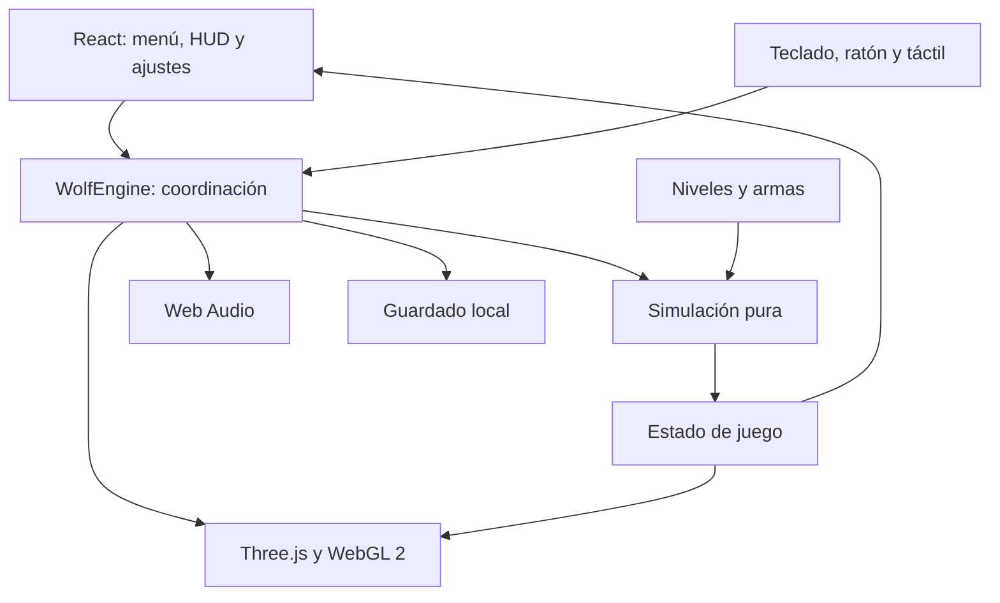
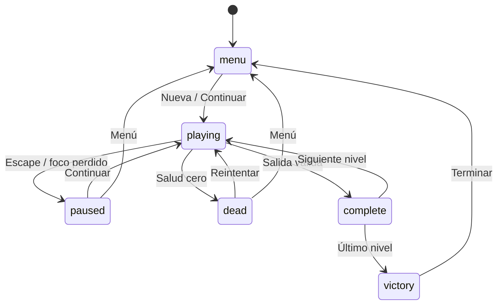

# Arquitectura

## Capas

React posee el estado de pantalla y la representación del HUD, pero no cada posición de actor. `WolfEngine` conserva una instancia de simulación mutable y emite una instantánea aproximadamente cada 100 ms. El motor puede comprobarse en Node sin DOM; el renderizador no es necesario para demostrar las reglas.

## Ciclo

Cada `requestAnimationFrame` acumula tiempo real, limita la recuperación a seis pasos y llama a `update` con 1/60 s. En pausa, menú, muerte, resultados y victoria no avanza la simulación. La escena puede seguir dibujándose para mostrar un fondo o un estado congelado. Las entradas continuas se leen por paso; las acciones discretas responden una vez a keydown.

El arreglo de eventos comunica disparo, impacto, muerte, recogida y transición al audio y al feedback. Se consume después de actualizar para no duplicar efectos. Las puertas y modelos interpolan su presentación con el estado simulado.

## Estado de partida

| Objeto | Campos principales |
|---|---|
| Game | version, status, difficulty, player, level, cooldown, seriales de feedback, totals |
| Player | x, z, yaw, hp, ammo, weapon, owned, gold, silver, lives, score |
| Level | index, grid, doors, items, enemies, exit, spawn, discovered y estadísticas |
| Door | id, x, z, axis, key, secret, open, target, found |
| Enemy | id, type, x, z, hp, state, cooldown, alert, path y temporizador |
| Item | id, type, x, z, value, taken |

Las coordenadas de reglas se expresan en celdas. Solo el renderizador multiplica por tres. Esto evita que un cambio de escala gráfica altere alcance, velocidad o IA.

## Estados de interacción

## Render

Una cámara de perspectiva muestra muros instanciados, piso/techo, puertas y actores. Ocho luces cálidas se asignan a las antorchas próximas; un spotlight sigue la mirada. La calidad alta activa sombras para ese foco. El arma vive en una segunda escena con cámara y luces propias, dibujada al final tras `clearDepth`.

Las texturas se cargan desde archivos propios del mismo origen. La construcción de los modelos no depende de servicios externos. Los materiales y geometrías de un nivel se liberan cuando cambia, y los recursos del motor se liberan en el desmontaje de React. Las texturas base compartidas permanecen hasta el cierre del motor.

## Guardado

`wolf3d-hd:save:v1` contiene el estado dinámico. `deserialize` comprueba versión, índice, recursos, coordenadas y armas; reconstruye la cuadrícula desde `makeLevel` y aplica solo cambios permitidos. Un JSON malformado no bloquea el arranque. Los ajustes se almacenan por separado bajo `wolf3d-hd:settings:v1`.

No hay cuenta, sincronización entre dispositivos, servidor de partidas ni garantía de persistencia si el navegador borra sus datos. Guardar en una URL y jugar en localhost produce espacios de almacenamiento diferentes.

## Distribución

La entrada principal del sitio es `app/page.tsx`. La entrada independiente es `index.html` → `standalone/main.jsx`; ambas montan el mismo componente. `vite.standalone.config.js` produce `playable/` sin servicios de backend. El servidor Node de distribución solo sirve esa carpeta y escucha en loopback.

Se registra opcionalmente una herramienta WebMCP de solo lectura para consultar la partida cuando el navegador anuncia la capacidad; su ausencia no afecta al juego. No cambia puntuaciones, recursos ni reglas.

## Extensión

- Nuevos niveles: añadir definición y datos en `levels.js`, respetando invariantes de objetivos y colisión.
- Nuevo enemigo: perfil de reglas en simulación y silueta en modelos; extender pruebas.
- Más materiales: añadir archivos propios y mapas de material al renderizador.
- Backend, multijugador o importar mapas históricos: requieren nuevos ADR; no son cambios triviales del HUD.

## Localización — v1.1

`i18n.js` y los catálogos `locales/es.js` y `locales/en.js` resuelven textos, plurales y números. La simulación emite claves y parámetros; el motor traduce las instantáneas y actualiza solo la textura de señalización al cambiar de idioma. React conserva la selección en `wolf3d-hd:language:v1`, separada del guardado v1. No se modifica la topología ni el estado de partida. Ver ADR 007.
